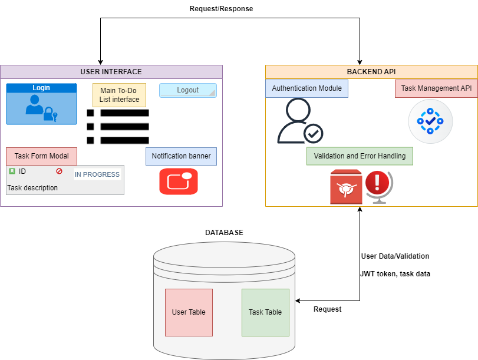
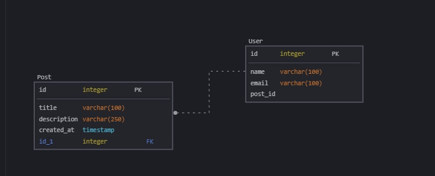
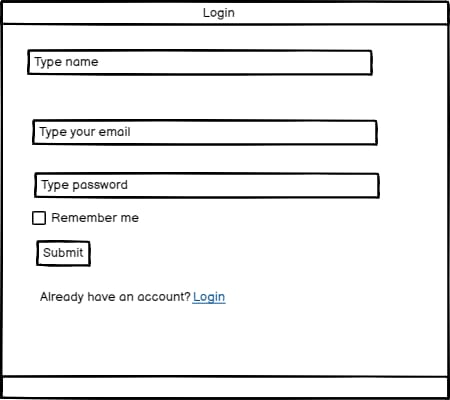
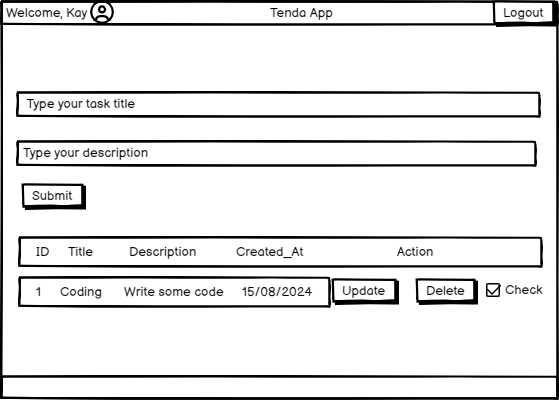

# TENDA APPLICATION

<!-- TABLE OF CONTENTS -->

# 📗 Table of Contents

- [📖 About the Project](#about-project)
- [💻 Features](#features)
- [🛠 Technologies](#technologies)
- [🚀 Live Demo](#live-demo)
- [🔭 Future Features](#future-features)
- [👤 Collaborators](#collaborators)

<!-- About the Project -->

## Project Overview

This is a Portfolio project for the Software Engineering program [Software Engineering Program](https://www.alxafrica.com/software-engineering/) by [ALX Africa](alxafrica.com), required for the foundation level of the program.

Tenda Application is developed as a practical project to apply and showcase our skills in software development. It is designed to help users manage their tasks efficiently by allowing them to create, view, edit, and delete to-do items.

## 📖 Project Description

The Tenda Application is a simple yet powerful tool to help users organize their daily tasks. It offers a clean and intuitive interface where users can add new tasks, mark them as completed, and delete or update them as needed. The application is built using modern web technologies and follows best practices for web development.

## Architecture

The Architecture of the Tenda Application:

## Data Model

The Data Model of the Tenda Application:

## Mockups

The Mockups of the Tenda Application:

<!-- Features and Functionalities-->

## 💻 Key Features:

- User registration and logins for personalized task management.

- Create, edit, and delete to-do tasks with ease.

- Mark tasks as completed to keep track of progress.

- Simple and intuitive user interface for a seamless experience.

- Ability to test solution without providing personal details.

<!--Technologies Used-->

## 🛠 Technologies

The Tenda Application is built using:

### Frontend:

- HTML5
- CSS3
- JavaScript (ES6+)

### Backend:

- Flask
- JWT for authentication

### Database:

- SQLAlchemy

 <!--Demo-->

## 🚀 Live Demo

> link to the live demo.

- [Live Demo Link]()

<!--Roadmap and Future Enhancements-->

## 🔭 Future Enhancements

- Implement task categories and labels for better organization.
- Add a reminder feature to notify users of upcoming tasks.
- Introduce task priority levels to help users prioritize their work.
- Add support for recurring tasks.
- Implement features designed for Screen Readers.

<!--Collaborators -->

## 👤 Team

👤 Emmanuel Danso

- GitHub: [EmmanuelDanso1](https://github.com/EmmanuelDanso1)

👤 Godman Oluwaseun

- GitHub: [GodmanOluwaseun](https://github.com/GodmanOluwaseun)

👤 Buyeke Obare

- GitHub: [buyekeobare](https://github.com/buyekeobare)
